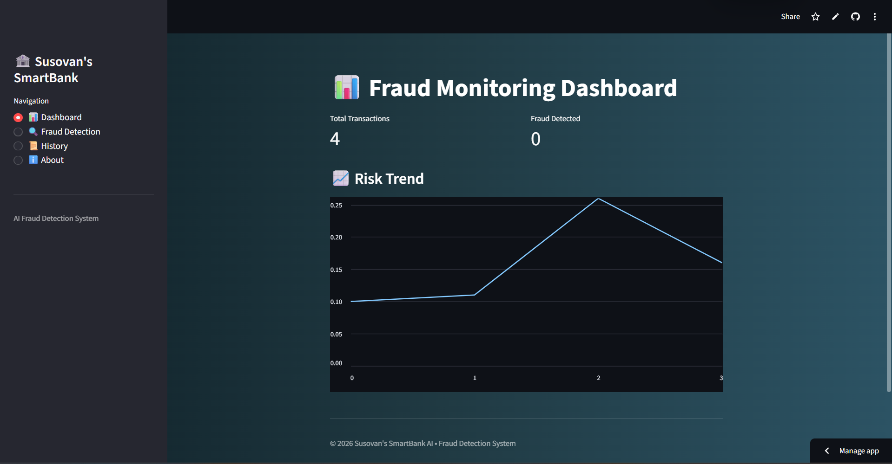
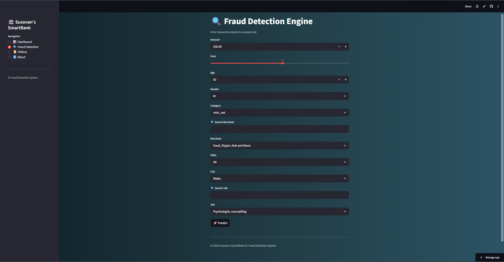
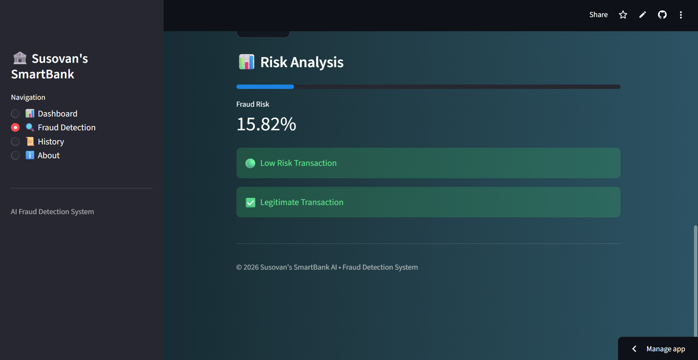
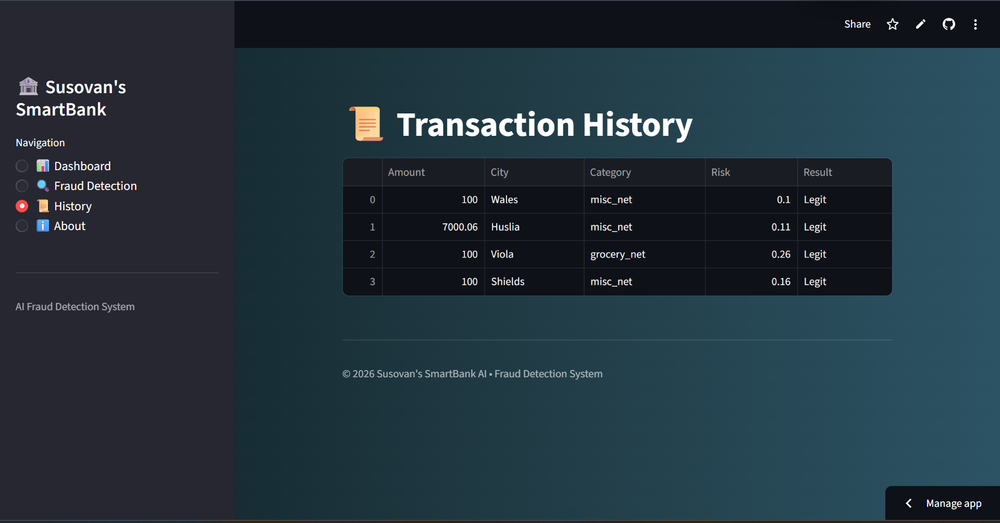
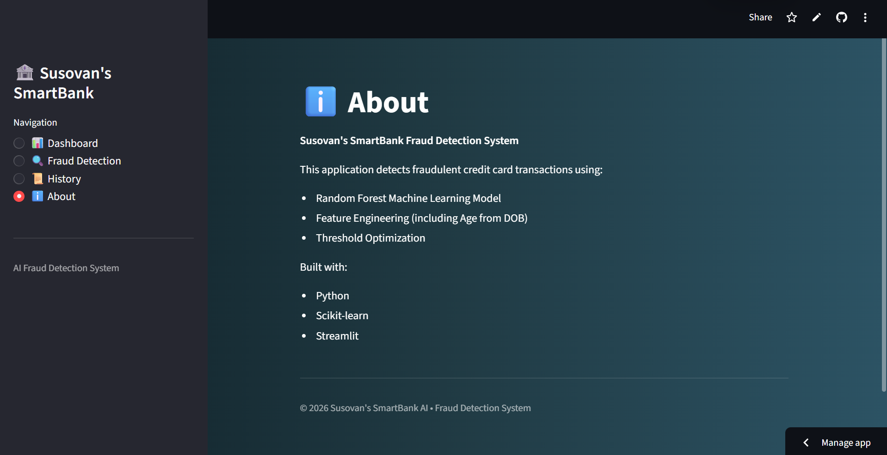

# 💳 SmartBank Fraud Detection System


An end-to-end **Machine Learning + Web Application** that detects fraudulent credit card transactions using behavioral patterns and transaction data.

---

## 🚀 Live Demo

👉 https://codsoftcreditcardfrauddetection-9jhdww74jjaf8trmqhdcwk.streamlit.app/

---

## 🖼️ Application Preview

### 📊 Dashboard


### 🔍 Fraud Detection Engine


### 📈 Risk Analysis


### 📜 Transaction History


### ℹ️ About Section


---

## ✨ Features

- 🔍 Real-time fraud prediction  
- 📊 Probability-based risk scoring  
- 🧠 Feature engineering (Age from DOB, time-based features)  
- 🌍 Location-aware inputs (State → City)  
- 🔎 Searchable inputs (Merchant, Job)  
- 📜 Transaction history tracking  
- 📊 Interactive dashboard with insights  

---

## 🧠 Machine Learning Pipeline

### Models Used
- Logistic Regression  
- Decision Tree  
- **Random Forest (Best Model Selected)**  

### Techniques Applied
- SMOTE (handling class imbalance)  
- Feature engineering  
- Threshold tuning (optimized for best F1 score)  
- Model evaluation and comparison  

---

## 📊 Model Performance

| Model | Precision | Recall | F1 Score | ROC-AUC |
|------|----------|--------|---------|--------|
| Logistic Regression | Low | High | Low | Good |
| Decision Tree | Medium | High | Medium | Very Good |
| **Random Forest** | **Best Balance** | High | **Best** | **Excellent** |

---

## 📁 Project Structure


credit-card-fraud-detection/
│
├── app.py
├── main.py
├── requirements.txt
│
├── models/
│ ├── model.pkl
│ ├── encoder.pkl
│ ├── features.pkl
│ ├── options.pkl
│ └── state_city_map.pkl
│
├── src/
│ ├── preprocess.py
│ ├── train.py
│ └── evaluate.py
│
└── assets/
├── dashboard.png
├── detection.png
├── risk.png
├── history.png
└── about.png


---

## ⚙️ Installation

```bash
git clone https://github.com/your-username/CODSOFT_Credit_Card_Fraud_Detection.git
cd CODSOFT_Credit_Card_Fraud_Detection
pip install -r requirements.txt
▶️ Run Locally
streamlit run app.py
🧪 Example Output
Fraud Probability Score
Risk Classification (Low / Medium / High)
Transaction Insights
🛠️ Tech Stack
Python
Scikit-learn
Pandas
Streamlit
Joblib
🎯 Use Cases
Banking fraud detection
Fintech risk analysis
Payment anomaly detection
Real-time transaction monitoring
📌 Future Improvements
🔐 Authentication system
📊 Advanced analytics dashboard
⚡ FastAPI backend integration
🌍 Multi-country support
👨‍💻 Author

Susovan Hati

📜 License

This project is licensed under the MIT License.


---
